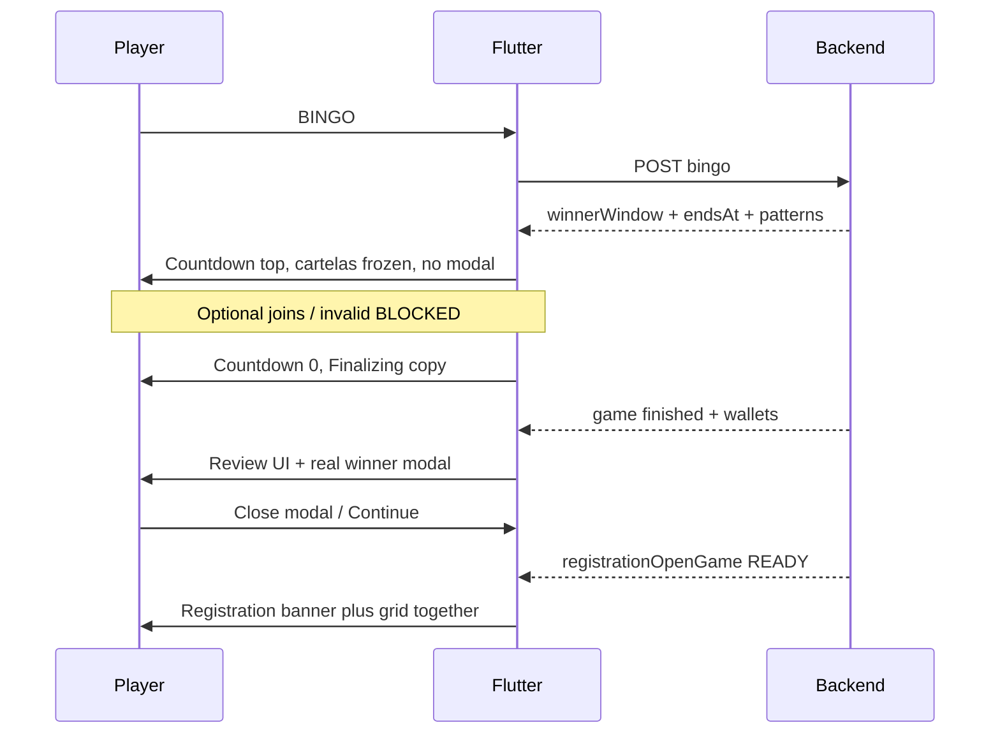

# Winner Flow — Backend ↔ Mobile Gap Analysis & UI Stability Guide

**Date:** 2026-07-10  
**Scope:** NestJS backend (`FriendsBingo`) + Flutter player app (`friends-admin-dahsboard`)  
**Method:** Code-verified against live sources after WW alignment + modal cleanup  
**Companion:** [`winner_window_flow.md`](../winner_window_flow.md) (backend-heavy; §20 partially stale — see §8 below)

---

## 1. Executive summary

### What is healthy

| Area | Status |
|------|--------|
| Backend status machine | Sound: `READY → PLAYING → WINNER_WINDOW → FINISHED` (or `NO_WINNER` from PLAYING) |
| Claim-now / pay-later | Correct: prizes only at `finalizeWinnerWindow()` |
| Flutter no longer invents `FINISHED` on countdown expiry | Fixed (refetch + closing hold) |
| Winner modal during WW | Fixed (finished/post-summary only) |
| Local ops overlay + WW pin | Fixed (stops live chrome flash during WW) |
| Transition lock unknown outcome | Improved (loading overlay, not guessed READY shell) |

### What still hurts players

| Pain | Why it feels bad | Owner |
|------|------------------|-------|
| Countdown hits 0 → “stuck syncing” | Finalize + grace (~750ms–2s+) before `game:finished` | Backend latency + Flutter gap UX |
| READY → PLAYING blank/loading up to 9s | Transition lock waits for ops confirmation | Flutter presentation |
| Docs still describe old “local FINISHED” | Misleads future work | Docs debt |
| Sticky `#0` / `0 ETB` placeholders | Display merge before API enrich | Flutter display helpers |
| No automated live-transition tests | Regressions only caught on device | Process |

### Stability principle (product contract)

> **Backend owns truth. Flutter owns comfort.**  
> Never invent session status. When truth is unknown, show **honest loading** — never a guessed registration/live/finished screen. When truth is known, paint it immediately and keep the same body shell through WW → review of the same session.

---

## 2. Canonical ownership matrix

| Concern | Backend | Flutter | Notes |
|---------|---------|---------|-------|
| Session status | **Owns** | Derive UI only | Never invent `FINISHED` / `PLAYING` / `READY` |
| `winnerWindowEndsAt` | **Owns** | Display countdown | Never invent duration |
| Claim validity / BLOCKED | **Owns** | Optimistic checking UX only | HTTP + sockets are truth |
| Prize split / wallet credit | **Owns** | Show after results + `wallet:updated` | Unpaid until finalize |
| Ops buckets (`live` / `checking` / `registration`) | **Owns** | Brief local overlay OK | Overlay must be overwritten by next HTTP ops |
| `LiveUiMode` / presentation phase | — | **Owns** | Presentation only |
| Sticky winning patterns | Payload from BE | **Owns** cache/clear policy | Clear on session change, not mid-WW |
| Post-game Continue / 60s hold | Timing config default | **Owns** review UI | `finishedResultDisplaySeconds` / summary hold |
| Transition loading vs guessed UI | — | **Owns** | Prefer loading |

---

## 3. End-to-end machine (aligned)

```text
READY ──start──► PLAYING ──first valid claim──► WINNER_WINDOW ──finalize──► FINISHED
                    │                              │
                    │                              ├── join claims (until endsAt + grace)
                    │                              └── invalid → cartela BLOCKED (session stays WW)
                    │
                    └── all balls + grace ──► NO_WINNER
                         (never from WINNER_WINDOW)

Invalid claim while PLAYING → cartela BLOCKED; session stays PLAYING
```

### Timing defaults (backend)

| Knob | Default | Player impact |
|------|---------|---------------|
| `winnerWindowSeconds` | 25s | Top countdown |
| `winnerWindowClaimGraceMs` | 750ms | Invisible join grace after UI shows 0 |
| Finalizer tick | 1s | Extra delay after grace before FINISHED |
| `finishedResultDisplaySeconds` | 60s | Ops may keep terminal in `liveGame` |
| Flutter post-summary hold | ~60s | Continue button + auto-advance |

**Worst-case player gap after countdown 0:** ~grace + up to 1s tick + finalize work ≈ **1–3s** typically; longer if finalizer process is unhealthy.

---

## 4. Socket / HTTP contract Flutter must follow

### Events that matter for winner UX

| Event | Flutter must | Must not |
|-------|--------------|----------|
| `game:bingo_checking` | Show checking chip / strip hold | Treat as winner |
| `game:bingo_invalid` | BLOCKED cartela; stay PLAYING or WW | Open winner modal |
| `game:winner_window_started` | Apply `winnerWindowEndsAt`, status WW, sticky patterns, ops overlay | Auto-open winner modal |
| `game:winner_window_joined` | Same join enrich; keep countdown from server | Reset countdown locally |
| `game:status_changed` | Optimistic patch + ops overlay for WW/FINISHED/NO_WINNER | Invent status without payload |
| `game:finished` | Terminal canonical refetch → review | Local FINISHED before this / ops |
| `wallet:updated` | Refresh balance | Assume prize at claim time |

### HTTP

| Endpoint | When |
|----------|------|
| `POST /games/sessions/:id/bingo` | Claim |
| `GET /games/operations/current` | Canonical ops (trust buckets) |
| `GET /games/sessions/:id/winner-results` | WW preload + finished modal (player-safe prizes) |

**Note:** Player ops snapshot **strips** `winnerPayoutsSummary`. Do not expect prizes from ops; use winner-results.

---

## 5. Flutter UI phases — comfort contract

| Phase | Player should feel | Must show | Must hide |
|-------|-------------------|-----------|-----------|
| **Registration open** | Calm join | Banner + grid together (atomic) | Live next-ball |
| **Live** | Focused play | Called strip + cartelas + next ball | Registration body swap mid-call |
| **Missed round** | Clear “you’re on next” | Next READY registration | Fake ownership of live |
| **Winner window** | Quiet hold | Top countdown; frozen cartelas; sticky patterns | Winner modal; next-ball chrome |
| **WW expired (closing)** | “Almost done” | Closing/syncing banner; same body | Invented FINISHED review |
| **Finished review** | Celebration + clarity | Summary + **real** winner modal + Continue | Registration grid until pin releases |
| **Unknown transition** | Trust | Loading overlay | Guessed READY/live shell |

### Comfort rules (necessity filter)

Only keep UI complexity that serves one of:

1. **Correctness** — matches backend status  
2. **Orientation** — player knows what phase they’re in  
3. **Evidence** — frozen marks / sticky patterns for disputes  
4. **Pacing** — brief checking hold, review hold, Continue  

Remove or simplify anything that:

- Invents status  
- Opens incomplete modals  
- Flashes a different shell for &lt;1s  
- Shows registration and live competing in the same viewport  

---

## 6. Gap analysis — backend vs mobile (current)

### 6.1 Closed gaps (recent work)

| Gap | Was | Now |
|-----|-----|-----|
| Ops lag → live chrome during WW | `_lastOperations` still PLAYING | Local ops overlay + WW pin |
| Invented FINISHED on expiry | Local `status: finished` + early review | `winnerWindowClosing` + terminal refetch |
| Winner modal during WW | Auto-open on sticky patterns | Finished review + loaded results only |
| Transition lock guessed READY | Snapshot registration shell for 9s | Loading until ops outcome known |

### 6.2 Open gaps (ordered by player impact)

#### G1 — Expiry → FINISHED latency (P0 UX)

**Backend:** Countdown ends at `winnerWindowEndsAt`; joins until `+ grace`; finalize when `endsAt + grace` passed; scheduler ticks 1s.  
**Flutter:** Correctly stays on WW closing UI.  
**Gap:** Player sees “0 / syncing” with no progress affordance. Feels broken if finalize is slow or finalizer process is down (`stuckSessions.overdueWinnerWindows`).

**Stability suggestion:**

- Keep closing hold (do not invent FINISHED).  
- Improve copy: “Finalizing winners…” + subtle progress (not a fake review).  
- Optional: poll ops/winner-results every 1s while `winnerWindowClosing` (cap 15s), then soft “Taking longer than usual — pull to refresh”.  
- Ops: alert on `overdueWinnerWindows > 0` for &gt;30s (backend health already exposes this).

#### G2 — Invisible claim grace (P2)

**Backend:** 750ms grace after UI 0.  
**Flutter:** Claims locked when expired.  
**Gap:** Rare “window closed” errors if player taps at 0.0s.

**Suggestion:** Lock claims at UI 0 (current) — prefer comfort over squeezing grace. Do not extend countdown with grace (would desync from server endsAt). Document for support.

#### G3 — READY → PLAYING / handoff loading (P1)

**Backend:** Status flips when start runs; ops may lag briefly.  
**Flutter:** 9s `ReadyTransitionLock`; unknown → loading overlay.  
**Gap:** Up to 9s of loading feels long; after TTL, refetch may still race.

**Suggestion:**

- Keep anti-guess loading (correct).  
- Shorten perceived wait: show last known phase chrome dimmed under overlay (“Starting round…”) instead of empty preparing.  
- On TTL expire: clear lock + forced ops refetch + one reconnect sync (already partial).  
- Do not paint registration grid until `registrationOpenGame` confirmed.

#### G4 — Winner dialog data quality (P1)

**Backend:** Prizes exist only after finalize; winner-results available in WW (preview) and FINISHED.  
**Flutter:** Auto-modal waits for `sessionWinnerResultsLoaded`; sticky merge can still invent `#0` / `0 ETB` for other winners in display helpers.

**Suggestion:**

- Auto-modal: require API results with non-empty `cartelaNumber` and patterns (current direction is good).  
- Never render placeholder `#0` / `0 ETB` in modal — show skeleton or omit until enrich.  
- Chip tap on finished: same gate.

#### G5 — Local ops overlay staleness (P2)

**Backend:** Canonical ops on HTTP.  
**Flutter:** Overlay sets `liveGame` from local `_game` on WW advance.

**Suggestion:** Always overwrite `_lastOperations` on next successful `operations/current`. Never merge overlay “forward” over a newer HTTP snapshot. Log when HTTP status &lt; local status for same session (debug only).

#### G6 — `NO_WINNER` vs `FINISHED` presentation (P2)

**Backend:** Both can appear as `playerStatus: 'finished'` in ops; distinguish via `rawStatus`.  
**Flutter:** Separate modes `reviewFinished` / `reviewNoWinner`.

**Suggestion:** Always prefer session `rawStatus` / model `GameStatus` over ops `playerStatus` for review copy. Verify remount during NO_WINNER doesn’t flash WW.

#### G7 — Doc / test debt (P1 process)

| Item | Issue |
|------|-------|
| `winner_window_flow.md` §20 | Still says local FINISHED on expiry |
| §23 weakness table | Still lists client local FINISHED as risk |
| Live-sync unit tests | Removed / absent — regressions device-only |

**Suggestion:** Patch §20 to match current Flutter; add a short “Flutter presentation contract” section pointing here. Restore a minimal golden-path test matrix (even widget/unit for pin + modal gate + no invent FINISHED).

#### G8 — Backend operational (out of Flutter scope)

| Item | Risk |
|------|------|
| In-process finalizer | Crash delays payouts |
| No admin early-finalize UI | Ops cannot force close |
| Admin socket often polling-only | Slow admin visibility |

These do not change Flutter ownership, but they amplify G1 for players.

---

## 7. Stability UX recommendations (prioritized)

### Must-have (comfort + correctness)

1. **One shell per session through WW → review** — keep `live-{sessionId}` body key (done).  
2. **No modal until finished + real results** (done).  
3. **No invented FINISHED** (done).  
4. **Honest loading on unknown transitions** (done for READY lock; extend copy for WW closing).  
5. **Atomic READY surfaces** — banner + grid together; never grid without banner (existing atomic helper — keep).  

### Should-have (comfort)

6. **WW closing copy** — “Finalizing winners…” with optional light poll.  
7. **Modal skeletons** — never `#0` / `0 ETB`.  
8. **Dimmed previous chrome under transition overlay** — orientation without guessing next status.  
9. **Claim checking** — keep ~800ms min for invalid/blocked; keep WW success immediate (done).  

### Nice-to-have (polish)

10. Soft haptic / short success pulse on WW open (countdown appears) — no modal.  
11. Prefetch winner-results in last 5s of WW (already) but **do not** open UI from preload.  
12. After Continue, hold patterns until READY session apply (policy already sticky).  

### Do not add

- Local FINISHED “healing” that starts review before `game:finished`  
- Auto winner modal on `winner_window_*`  
- Invented next-ball countdown during WW  
- Second AnimatedSwitcher remount mid-WW  
- Extending visible countdown by grace ms (desyncs from server)  

---

## 8. Doc corrections vs `winner_window_flow.md`

| Claim in §20 / §23 | Reality (2026-07-10) |
|--------------------|----------------------|
| Expiry locally sets `FINISHED` and starts summary | **False** — sets `winnerWindowClosing` + terminal refetch only |
| `_maybeAutoShowWinnerCartelaDialog` on WW socket | **False** — removed; modal finished-only |
| Min checking display before WW UI update | **Partial** — WW success skips 800ms delay |
| Client local FINISHED is architecture weakness | **Mitigated** — remove from active risk list; replace with “expiry gap UX” |

---

## 9. Recommended player journey (target)



---

## 10. Manual QA checklist (stability)

1. Valid BINGO → WW countdown immediate; **no** modal; patterns sticky  
2. Second valid join → countdown unchanged; still no modal  
3. Invalid claim → BLOCKED; stay PLAYING or WW  
4. Countdown 0 → closing/finalizing UI; **not** review until server finish  
5. Finish → review + modal with real cartela # and prize  
6. Continue / 60s → READY registration atomic (banner+grid)  
7. All balls no winner → NO_WINNER review (not WW)  
8. Remount during WW → reconnect; no invented FINISHED  
9. READY→PLAYING → loading/orientation, not guessed empty registration for 9s  
10. Kill network at WW expiry → honest syncing/retry, not fake finished  

---

## 11. Suggested next implementation slice (Flutter-only)

If continuing stability work without touching NestJS:

| Priority | Change | Why |
|----------|--------|-----|
| P0 | WW closing banner copy + capped poll while `winnerWindowClosing` | Reduces “stuck” feeling (G1) |
| P1 | Modal/list: suppress `#0` / `0 ETB` placeholders | Comfort + trust (G4) |
| P1 | Update `winner_window_flow.md` §20/§23 | Stop reintroducing invent-FINISHED (G7) |
| P2 | Dim previous chrome under READY-lock overlay | Orientation (G3) |
| P2 | Assert HTTP ops always replaces local overlay | Staleness (G5) |

Backend-adjacent (separate track): admin finalize button, finalizer health alerts, distributed finalizer.

---

## 12. File index

### Backend

| Path | Role |
|------|------|
| `FriendsBingo/src/bingo-claims/bingo-claims.service.ts` | Claim, open/join WW, finalize |
| `FriendsBingo/src/bingo-claims/winner-window-finalizer.service.ts` | 1s scheduler |
| `FriendsBingo/src/game-timing-config/game-timing-config.defaults.ts` | Timing defaults |
| `FriendsBingo/src/games/game-status.rules.ts` | Transition matrix |
| `FriendsBingo/src/games/dto/game-operations.dto.ts` | Ops contract |

### Flutter

| Path | Role |
|------|------|
| `lib/.../utils/live_ui_mode.dart` | Mode resolver, WW pin, lock loading |
| `lib/.../utils/live_presentation_phase.dart` | Phases, WW active/expired, post-summary gate |
| `lib/.../utils/live_game_finish_transition.dart` | Pin + hold paint |
| `lib/.../utils/live_embedded_operations_snapshot.dart` | Local ops overlay |
| `lib/.../utils/live_ready_transition_lock.dart` | 9s lock + outcome known |
| `lib/.../utils/winner_pattern_clear_policy.dart` | Sticky patterns |
| `lib/.../utils/session_winner_results_for_display.dart` | Results merge + dialog readiness |
| `lib/.../screens/live_game_orchestration.dart` | WW apply, expiry, modal gate |
| `lib/.../screens/live_game_winner_window.dart` | Countdown / closing banner |
| `lib/.../screens/live_game_screen.dart` | Body key, overlays |
| `lib/.../screens/live_game_called_numbers.dart` | Claim + chip gate |

---

## 13. Definition of “stable” for this product

The winner flow is **stable** when:

1. Every visible phase maps to a backend status (or an explicit loading hold).  
2. No screen appears that could belong to a different phase after removing chrome.  
3. WW never shows the finished winner modal.  
4. Finished never appears before server finalize (wallet may still lag slightly — acceptable).  
5. READY registration appears as one composition (banner + grid), not a mid-swap flash.  
6. A player can explain the phase in one sentence (“waiting for others to claim”, “round finished”, “registering next”).  

Anything that violates those six points is a stability bug, not a polish item.
