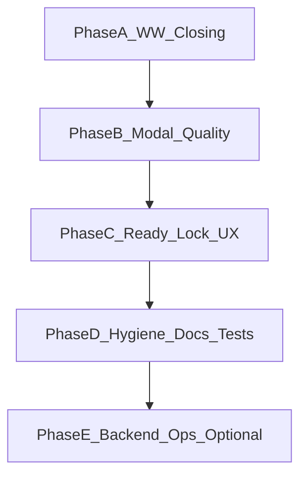

# Winner Flow Stability — Implementation Plan

**Date:** 2026-07-10  
**Source gaps:** [`2026-07-10-winner-flow-backend-mobile-gap-stability.md`](./2026-07-10-winner-flow-backend-mobile-gap-stability.md)  
**Scope default:** Full Flutter stability slice (P0–P2) + docs/tests; backend ops tooling as Phase E (separate track).  
**Constraint:** Do **not** reintroduce local `FINISHED` invent or WW auto-modal. NestJS game machine frozen except Phase E admin/ops wiring.

---

## Overview

Close remaining winner-flow gaps so the player journey is stable and complete:

```text
LIVE → WW (countdown only) → closing/finalizing → FINISHED review + real modal
  → Continue/60s → READY (banner+grid atomic)
```

Unknown gaps show honest loading/orientation — never guessed shells or `#0` / `0 ETB` modals.

---

## Goal / non-goals

### Goal

| Player moment | Must feel |
|---------------|-----------|
| WW open | Countdown + frozen cartelas; no modal |
| WW expired | “Finalizing winners…” until server finish |
| Finished | Real winner modal + Continue / 60s |
| READY handoff | Atomic registration; no mid-swap flash |
| Unknown transition | Loading + orientation, not guessed UI |

### Non-goals

- Invent local `FINISHED` before `game:finished` / canonical apply  
- Auto-open winner modal during `WINNER_WINDOW`  
- NestJS claim/status/finalize algorithm changes  
- Distributed finalizer rewrite (ops note only)

---

## Phase A — WW closing comfort (G1) P0

**Problem:** Countdown hits 0 → generic syncing; player feels stuck until finalize.

**Files:**
- [`lib/src/features/games/presentation/screens/live_game_winner_window.dart`](../../lib/src/features/games/presentation/screens/live_game_winner_window.dart)
- [`lib/src/features/games/presentation/screens/live_game_orchestration.dart`](../../lib/src/features/games/presentation/screens/live_game_orchestration.dart)
- [`lib/src/features/games/presentation/controllers/live_review_controller.dart`](../../lib/src/features/games/presentation/controllers/live_review_controller.dart)
- l10n: `lib/l10n/app_en.arb` (+ am/om/ti)

**Steps:**
1. When `_winnerWindowExpired && status == winnerWindow` (or `winnerWindowClosing`): banner = **“Finalizing winners…”** + short supporting line (not generic syncing).
2. While `winnerWindowClosing`, start a **capped poll** (every 1s, max 15 attempts) via existing terminal canonical refetch / ops sync — stop on FINISHED/NO_WINNER apply or unmount.
3. After cap without terminal status: keep WW closing UI + soft retry (“Taking longer than usual”) via existing sync/retry affordance.
4. **Do not** set local `FINISHED` or start post-game summary here.

**Done when:** Expiry shows finalizing copy; review only after server terminal apply.

---

## Phase B — Winner modal data quality (G4) P1

**Problem:** Sticky merge invents `cartelaNumber: 0`, `amount: '0'` for non-owned winners.

**Files:**
- [`lib/src/features/games/presentation/utils/session_winner_results_for_display.dart`](../../lib/src/features/games/presentation/utils/session_winner_results_for_display.dart)
- Winner dialog widget (`showWinnerCartelaDialog` and related)
- [`live_game_orchestration.dart`](../../lib/src/features/games/presentation/screens/live_game_orchestration.dart) auto-show / chip tap

**Steps:**
1. Add `isCompleteWinnerResultForModal(result)` — requires `cartelaNumber > 0`, non-empty patterns, and a matching API `sessionWinnerResults` row for that `gameCartelaId` (no sticky-only placeholders in modal).
2. Sticky-only entries without API row: **exclude from modal list** (cartela-grid sticky patterns may remain).
3. Auto-show / chip tap: open only when filtered modal list is non-empty and every entry is complete.
4. If review active but incomplete: review banner loading; no dialog until ready.

**Done when:** Finished modal never shows cartela #0 / Prize 0 ETB for real winners.

---

## Phase C — READY lock orientation (G3) P1

**Problem:** Unknown READY→PLAYING feels blank for up to 9s.

**Files:**
- [`lib/src/features/games/presentation/utils/live_ui_mode.dart`](../../lib/src/features/games/presentation/utils/live_ui_mode.dart)
- [`lib/src/features/games/presentation/screens/live_game_screen.dart`](../../lib/src/features/games/presentation/screens/live_game_screen.dart)
- [`lib/src/features/games/presentation/utils/live_ready_transition_lock.dart`](../../lib/src/features/games/presentation/utils/live_ready_transition_lock.dart)
- [`lib/src/features/games/presentation/controllers/live_transition_controller.dart`](../../lib/src/features/games/presentation/controllers/live_transition_controller.dart)

**Steps:**
1. Keep registration grid off while outcome unknown (already).
2. Under transition-lock loading overlay: keep **dimmed last-known body** visible; overlay title **“Starting round…”** (handoff-specific copy for `noPlayersHandoff`).
3. On TTL expire: confirm clear lock + immediate canonical refetch (strengthen if missing).
4. Never paint guessed READY grid from `snapshotGame`.

**Done when:** READY→PLAYING shows orientation + loading, not empty guessed registration.

---

## Phase D — Hygiene + NO_WINNER + docs + tests (G5, G6, G7)

### D1 — Ops overlay overwrite (G5) P2

**File:** `live_game_orchestration.dart` (canonical apply)

**Steps:**
1. On successful HTTP `operations/current`, always `_lastOperations = operations` (no forward-merge of local overlay over newer HTTP).
2. Debug-only log when same-session HTTP status rank &lt; local `_game.status`.

### D2 — NO_WINNER presentation (G6) P2

**Files:** `live_ui_mode.dart`, orchestration terminal apply

**Steps:**
1. Review mode/copy keys off `GameModel.status` (`noWinner` vs `finished`), never ops `playerStatus: 'finished'` alone.
2. Remount/resume during `NO_WINNER` → `reviewNoWinner`; no WW flash.

### D3 — Docs (G7) P1

**Files:**
- [`docs/winner_window_flow.md`](../winner_window_flow.md) §20, §23
- Cross-link to this audit + plan

**Steps:**
1. Rewrite §20: expiry → closing hold + refetch; modal finished-only; WW success skips 800ms delay.
2. Replace “client local FINISHED” weakness with “expiry gap UX / finalizer latency”.
3. Add short “Flutter presentation contract” pointer to the gap-stability audit.

### D4 — Minimal pure-Dart regression guards (G7) P1

**New tests under** `test/features/games/` (helpers only — no full widget suite)

**Cover:**
- `shouldPinTerminalSession(winnerWindow)` → true  
- Modal completeness helper → false for sticky `#0`/`0`  
- `winnerDialogReadyForImmediateShow` → false without post-summary  
- `isReadyTransitionLockOutcomeKnown` → false when ops null  

---

## Phase E — Backend ops tooling (G8) — runbook note

`friends_bingo_Admin` is **not in this workspace**. Until the admin app is available:

1. Wire **Finalize winners now** to `PATCH /admin/sessions/:id/finalize-winner-window` when `playerStatus === "winnerWindow"`.
2. Alert when `/health` reports `stuckSessions.overdueWinnerWindows > 0` for more than 30 seconds.

Flutter closing poll (Phase A) mitigates player UX during finalize lag but does not replace ops tooling.

---

## Execution order



---

## Todos

| ID | Content | Priority |
|----|---------|----------|
| `phase-a-ww-closing` | WW closing copy + capped poll while `winnerWindowClosing` | P0 |
| `phase-b-modal-quality` | Filter incomplete sticky `#0`/`0 ETB`; gate modal on complete API rows | P1 |
| `phase-c-ready-lock` | Dimmed chrome + Starting round overlay; TTL forced refetch | P1 |
| `phase-d-hygiene-docs` | Ops overwrite, NO_WINNER status, docs §20/§23, helper unit tests | P1/P2 |
| `phase-e-backend-ops` | Admin finalize button + overdue WW alert note (optional track) | Ops |

---

## Manual QA (must pass)

From audit §10, plus:

1. WW expiry → “Finalizing winners…” then real review (not invent FINISHED)  
2. Finished modal never shows cartela #0 / Prize 0 ETB for real winners  
3. READY→PLAYING: dimmed prior chrome + “Starting round…”  
4. NO_WINNER remount → no-winner review copy  
5. Docs §20 matches code  

---

## Definition of done

- No local `FINISHED` before canonical terminal apply  
- No winner modal during WW; finished modal only with complete API-backed rows  
- WW closing and READY-lock unknown states have explicit honest copy + loading  
- HTTP ops always replaces local overlay  
- `winner_window_flow.md` §20/§23 corrected  
- Helper unit tests green for pin / modal completeness / lock outcome  
- Backend game machine untouched (Phase E is admin/ops only)
