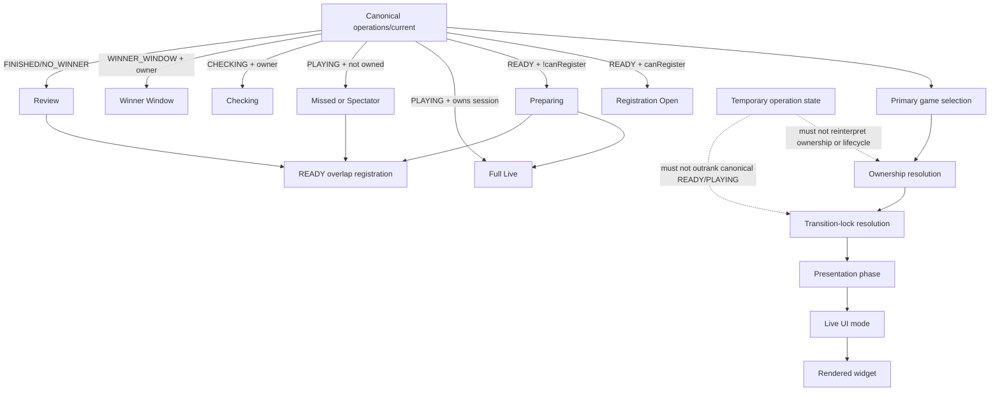

# UI Consistency Audit for Registration, Live, Missed, and Transition States

Date: Wednesday, August 5, 2026

## Summary

This audit reviewed the Flutter live-game presentation stack in `friends-admin-dahsboard` and used `FriendsBingo` only as the canonical backend reference for:

- session lifecycle state
- `canRegister`
- `GET /games/operations/current`

The screen-selection pipeline is mostly coherent now, and several July 2026 fixes are working:

- canonical `PLAYING` is protected against stale same-session `READY` snapshots by the sticky owned-live fallback
- backend `canRegister=true` already outranks an expired local countdown in the registration phase resolver
- missed-player overlap with `PLAYING/CHECKING/WINNER_WINDOW A + READY B` is intentionally handled by canonical operations plus a read-only preview
- resume and reconnect share one operations sync request path through `GameOperationsSyncCoordinator`

The remaining intermittent "wrong Preparing wins" bug is not one single countdown issue. The highest-confidence failure is a stale transition-lock/session-scoping problem, with ownership reconciliation and resume/apply ordering as secondary contributors.

## Final Verdict

Primary classification: **G. Multiple contributing causes**

Proven root cause:
- A stale `preparingToPlay` transition lock can preserve Game A's visual shell after canonical operations have already moved on to a different session, allowing a local Preparing path to beat the next `READY` registration.

Secondary contributors:
- The UI has strong `owned` and `missed` paths, but no explicit `ownership unresolved` presentation state. During live-session reconciliation, an empty local cartela list can temporarily mean "not yet known" but is treated as "not owned".
- Resume/reconnect and local socket apply timestamps prevent many stale applies, but a stale lock shell can still remain visible until a later refetch or timeout.
- Temporary operation flags such as `isLoading`, `awaitingLiveRoom`, and registration-grid hydration can suppress the registration shell and replace it with loader UI, which makes the wrong winner more visible even when lifecycle truth is already known.

Smallest safe patch:
- Clear or ignore a `preparingToPlay` lock as soon as canonical operations show that the locked session is no longer the live/checking session and a different `READY` session is now the registration target.
- During live-session ownership reconciliation, treat empty cartelas as unresolved until the existing ownership fetch completes; do not let that temporary state prove `missed` or preserve stale `READY/Preparing`.

Exact regression boundary:
- Limit the fix to the Flutter presentation pipeline in `live_ready_transition_lock.dart`, `live_transition_controller.dart`, `live_ui_mode.dart`, and `live_game_orchestration.dart`.
- Do not change backend contracts, wallet logic, registration transactions, auto-call rules, winner validation, or socket architecture.

Why no broader redesign is needed:
- The current architecture already has the right major pieces: canonical operations, session-scoped ownership helpers, a centralized UI resolver, and coalesced resume/reconnect sync.
- The bug comes from a few local holds and reconciliation gaps outranking canonical truth at the wrong time, not from the overall backend model or the existence of the resolver itself.

## Canonical Screen-Selection Trace

The final rendered screen is selected through this chain:

```text
GET /games/operations/current
-> _loadGame(...)
-> _resolvePrimaryFromOperations(...) / _resolvePrimaryGameForOperationsWithTransitionLock(...)
-> ownership resolution
   - _ownsLiveCartelasForOperations(...)
   - ownsLiveSessionCartelas(...)
   - preloaded getMyGameCartelas(...) on overlap path
-> _applyCanonicalGame(...)
-> resolveLiveUiMode(...)
-> LivePresentationPhaseResolver.resolve(...)
-> LiveUiModeState
-> LiveGameScreen._buildBody()
-> _buildRegistrationOpenBody() / _buildStickyLiveScrollView() / _buildFullScrollContent()
-> rendered widget
   - _PreparingGamePanel
   - Center(FriendsBingoLoader.inline)
   - registration grid
   - live cartela scroll
   - missed-round registration section
```

Important render destinations for wrong-Preparing cases:

- `LiveGameScreen._buildRegistrationOpenBody()` renders `_PreparingGamePanel` when:
  - the registration layout is active,
  - the registration grid is visible,
  - and cartela actions are disabled because the presentation phase resolved to `preparingGame`
- `LiveGameScreen._buildRegistrationOpenBody()` renders `Center(FriendsBingoLoader.inline)` when:
  - the registration layout is active,
  - but `showRegistrationGrid` is false for a non-guest
- `LiveGameScreen._buildBody()` falls back away from the registration layout when temporary screen-blocking flags are active

For every failing row below, the trace continues all the way to one of those final render targets.

## State Classification

### Canonical lifecycle state

These are backend truth and should own lifecycle interpretation:

- `GameModel.status`
- `GameModel.canRegister`
- `GameOperationsCurrentResponse.liveGame`
- `GameOperationsCurrentResponse.checkingGame`
- `GameOperationsCurrentResponse.registrationOpenGame`

### Derived presentation state

These are Flutter-only and should never rewrite lifecycle truth:

- `LivePresentationPhase`
- `LiveUiMode`
- `useRegistrationOpenLayout`
- `showRegistrationGrid`
- `showMissedRoundWrapper`
- `blocksRegistrationPromotion`

### Temporary operation state

These are loading/reconciliation conditions and must not decide lifecycle or ownership:

- `_isLoading`
- `_awaitingLiveRoom`
- `resumeSyncInFlight`
- `canonicalRefetchInFlight`
- `registrationGridReady`
- `readyTransitionLock`
- `registrationCountdownClosed`
- `_lastSocketAppliedAt` vs operations request start
- delayed silent cartela refresh timers
- `resolveResumeMyCartelasFetch(... reason: 'ownership_unknown')`

### Where temporary state currently leaks into interpretation

1. `live_ui_mode.dart` -> `_screenBlocked(...)`
- `isLoading`, `awaitingLiveRoom`, and `hasError` can suppress the registration-open layout entirely.

2. `live_ready_transition_lock.dart` -> `resolvePrimaryGameForOperationsWithTransitionLock(...)`
- a local lock can keep an old READY snapshot primary even when canonical operations have already selected a different session.

3. `live_game_orchestration.dart` -> `_loadGame(...)`
- ownership can be inferred from fetched cartelas, previous local cartelas, or an empty fallback when fetches fail or have not completed.
- that means a temporary fetch state can become an ownership interpretation.

4. `live_game_screen.dart` -> `registrationGridReady`
- registration hydration is temporary, but it can replace the grid with loader UI and visually win the screen.

## UI State Machine



## Source Inventory

| Value | File / method | Session identity | Backend-confirmed or local-only | Writers | Clear / exit paths | Survives session change | Can override newer backend truth |
| --- | --- | --- | --- | --- | --- | --- | --- |
| `_game` | `live_game_orchestration.dart` -> `_applyCanonicalGame`, socket handlers, terminal helpers | active primary session | mixed | canonical apply, socket status/winner patches, terminal local finish, session-id resolution | canonical apply, terminal clear, empty-state clear | yes, until replaced | yes, via local socket/lock shell until canonical apply lands |
| `_lastOperations` | `live_game_orchestration.dart` -> `_applyCanonicalGame`, `_refreshLocalOperationsSnapshotIfNeeded` | canonical live/checking/registration sessions | backend-confirmed, plus local synthetic snapshot | operations sync, local winner-window/live snapshot refresh | cleared on empty/error/session clear | yes | yes, local synthetic snapshot can temporarily outrank fresher HTTP until next fetch |
| `registrationOpenGame` | backend ops + `GameOperationsCurrentResponse` | registration session | backend-confirmed | operations fetch only | next ops snapshot | no, by definition | only through downstream resolver decisions |
| `liveGame` / `checkingGame` | backend ops + local synthetic ops snapshot | blocking live session | backend-confirmed, plus local synthetic snapshot | operations fetch, `_refreshLocalOperationsSnapshotIfNeeded` | next ops snapshot | no | local synthetic snapshot can temporarily stand in for missing ops |
| `registrationCountdownClosed` | `LiveCountdownController` via `LiveTransitionController` and canonical apply sync | current READY session shell only | local-only | countdown close, empty handoff, preparing entry, session sync | `_syncRegistrationCountdownClosedState`, reopen helper, session clear | can linger if not reset | yes, if paired with stale lock/shell |
| `readyTransitionLock` | `live_transition_controller.dart` | explicitly session-scoped | local-only | countdown close enters preparing/no-players handoff | sync clear, timeout, explicit clear | yes until cleared or timeout | yes, this is the highest-confidence wrong Preparing winner |
| `_myCartelas` | `live_game_orchestration.dart`, registration handlers, silent refresh | current primary session | backend-confirmed but cached locally | canonical apply, registration success, silent refresh | session change clear, empty-state clear | no when canonical session changes, but fallback can be reused | yes, empty or stale local list can affect ownership decisions |
| `_nextRegistrationCartelas` | canonical apply + silent refresh | tracked READY registration session | backend-confirmed but cached locally | canonical apply, queued registration success, silent refresh | session target change, empty-state clear | yes until target changes | yes for previewed ownership of READY B |
| `trackedRegistrationSessionId` | `live_game_orchestration.dart` / `live_registration_controller.dart` | current non-primary READY target | derived from `liveUiMode.registrationTarget` | resolver output only | becomes null when target changes or current game matches | no | indirectly, because event routing and silent refresh follow it |
| `resumeSyncInFlight` / `canonicalRefetchInFlight` | `live_realtime_controller.dart` | global screen sync | local-only | resume/reconnect/manual refresh and canonical refetch queue | sync completion or failure | yes across lifecycle callbacks | yes, via temporary screen-blocking and poll suppression |
| `registrationGridReady` | `LiveSessionHolds` from `registrationStateProvider(...).hasValue` | registration body target session | temporary operation state | provider hydration | provider success / session target change | no | yes, visually, because it can hide the grid and show loader UI |
| `_lastSocketAppliedAt` | `LiveGameScreen.markCanonicalSocketStateApplied()` | last socket-mutated session context | local-only | canonical socket patches and local operations refresh | overwritten by next socket apply | yes | used correctly to skip stale ops snapshots |
| `resolvedSessionId` in registration panel | `registration_panel_session.dart` / `live_game_registration.dart` | per slot panel session | local-only | registration responses and widget updates | panel reset / dispose | yes for that slot panel | yes if stale panel state is consulted before canonical session update |

## Decision Table

| Row | Primary status | Live status | Registration status | canRegister | Owns live | Owns ready | Transition lock | Countdown closed | Expected UI | Current UI result |
| --- | --- | --- | --- | --- | --- | --- | --- | --- | --- | --- |
| 1 | READY A | none | READY A | true | n/a | yes or no | none | false | Registration Open | Registration Open |
| 2 | READY A | none | READY A | false | n/a | yes | none | true or false | Preparing | Preparing |
| 3 | READY A with stale `scheduledStartAt` | none | READY A | true | n/a | yes or no | none | true | Registration Open | Registration Open |
| 4 | PLAYING A | PLAYING A | none | false | yes | n/a | none | n/a | Full Live | Full Live |
| 5 | PLAYING A | PLAYING A | none | false | no | n/a | none | n/a | Missed / Spectator | Live spectator if no READY overlap; missed-round registration if READY overlap exists |
| 6 | READY B | PLAYING A | READY B | true | no | yes | none | n/a | B Registration + A preview | Correct |
| 7 | READY B | CHECKING A | READY B | true | no | yes | none | n/a | B Registration + Checking preview | Correct |
| 8 | READY B | WINNER_WINDOW A | READY B | true | no | yes | none | n/a | B Registration + Winner preview | Correct |
| 9 | READY B | none | READY B | true | n/a | yes or no | none | false | Registration Open | Registration Open |
| 10 | PLAYING A | PLAYING A | none | false | unresolved because registration is still reconciling | n/a | none | n/a | Neutral finalizing/loading state, never missed and never stale registration | **No explicit unresolved state**. Can resolve to spectator from empty `_myCartelas`, or keep stale shell if another local hold is still active |
| 11 | READY B | none | READY B | true | n/a | yes | stale `preparingToPlay` lock from A | true | Immediate B Registration Open | **Failing**: A Preparing shell can remain until lock clear or timeout |
| 12 | READY / PLAYING post-resume | none or stale local | READY B or PLAYING A | backend-dependent | unresolved while sync applies | backend-dependent | stale lock may still exist | stale local value | Authoritative backend state wins immediately | **Failing in lock case**: resume can preserve stale shell before canonical replacement finishes |
| 13 | READY or PLAYING after reconnect | stale READY snapshot may arrive | backend current session | backend-dependent | backend-dependent | backend-dependent | none | n/a | Latest ops wins | Mostly protected by stale-snapshot skipping and sync coalescing |

## Failing Resolver Traces

### Row 10: Canonical PLAYING, ownership unresolved

Expected:
- temporary neutral/finalizing/loading state until ownership finishes reconciling
- never `missed`
- never stale `READY/Preparing`

Current trace:

```text
operations/current
-> _loadGame(...)
-> liveCandidate = ops.liveGame
-> if there is no READY overlap, _loadGame does not prefetch ownership before primary selection
-> _resolvePrimaryFromOperations(... ownsLiveCartelas: _ownsLiveCartelasForOperations(ops))
-> _ownsLiveCartelasForOperations(...) -> ownsLiveSessionCartelas(...)
-> empty local _myCartelas == false ownership
-> _applyCanonicalGame(...)
-> resolveLiveUiMode(...)
-> _modeForPrimary(PLAYING, ownsLiveCartelas=false, hasPrimarySessionCartelas=false)
-> LiveUiMode.liveSpectator
-> _buildBody() -> sticky live body
```

Why this fails:
- `resolveResumeMyCartelasFetch(...)` already acknowledges `ownership_unknown`, but that temporary state never becomes a UI state.
- ownership is binary in the resolver path: owned or not-owned.
- during the reconciliation window, "empty local cartelas" is allowed to mean "missed".

Which function wins:
- `ownsLiveSessionCartelas(...)` and `_modeForPrimary(...)` win because there is no third unresolved outcome.

### Row 11: Game A lock keeps Preparing over READY B

Expected:
- when canonical operations remove blocking live A and open READY B, B registration appears immediately

Current trace:

```text
operations/current
-> _loadGame(...)
-> _resolvePrimaryFromOperations(...)
-> LiveTransitionController.resolvePrimaryFromOperations(...)
-> resolvePrimaryGameForOperationsWithTransitionLock(...)
-> active preparingToPlay lock for session A
-> live == null
-> registrationOpenGame == READY B
-> preparingToPlay lock does not allow registrationOpenGameSupersedesTransitionLock(...)
-> returns lock.snapshotGame (READY A)
-> resolveLiveUiMode(...)
-> _activeTransitionLock(...) != null
-> _buildForTransitionLock(...)
-> outcome unknown
-> LiveUiMode.registrationWaitingForCurrentGame
-> _buildBody() -> _buildRegistrationOpenBody() or loader shell path
-> _PreparingGamePanel or centered loader wins instead of B registration
```

Why this fails:
- `registrationOpenGameSupersedesTransitionLock(...)` intentionally ignores a preparing-to-play lock.
- `shouldClearReadyTransitionLock(...)` clears for same-session live/checking or no-players handoff, but not for "new READY session B replaced session A".

Which function wins:
- `resolvePrimaryGameForOperationsWithTransitionLock(...)` wins by returning the stale lock snapshot.

### Row 12: Resume with stale preparing lock

Expected:
- authoritative backend state should win immediately on resume

Current trace:

```text
app resume
-> _recoverFromAppResume()
-> LiveRealtimeController.syncLatest(reason: 'app_resume')
-> _loadInitialState(resumeSync: true)
-> if incoming game is temporarily null or not yet applied, shouldKeepTransitionLockShell(...)
-> keeps current shell and forces registrationCountdownClosed = true
-> stale lock survives until refetch or timeout
-> resolveLiveUiMode(...)
-> _buildForTransitionLock(...) or preparing presentation path
-> Preparing shell remains visible during/after resume
```

Why this fails:
- the stale shell hold is trying to prevent empty flashes, but it is not strict enough about session ownership.
- it can preserve the wrong session while the authoritative resume snapshot is already moving toward a different session.

Which function wins:
- `shouldKeepTransitionLockShell(...)` wins by preserving the stale shell before canonical replacement finishes.

### Row 11 plus Row 12 combined: why the bug feels like the registration list was replaced or covered

Final render path:

```text
LiveUiMode.registrationWaitingForCurrentGame
-> LivePresentationPhase.preparingGame
-> _buildBody()
-> _buildRegistrationOpenBody()
-> if showRegistrationGrid == true and cartelaActionsEnabled == false:
   _PreparingGamePanel
-> if showRegistrationGrid == false for non-guest:
   Center(FriendsBingoLoader.inline)
```

That is the exact point where the wrong Preparing winner becomes the visible screen.

## Preparing Source Audit

### Entry paths that can select Preparing correctly

1. `LivePresentationPhaseResolver._resolveRegistrationPhase(...)`
- `game.status == READY`
- `game.canRegister == false`
- returns `LivePresentationPhase.preparingGame`

2. `LiveTransitionController.enterRegistrationPreparing(...)`
- local countdown closes for a READY session with cartelas or a pending start transition
- sets `registrationCountdownClosed = true`
- may start a `preparingToPlay` lock

3. `LiveUiModeResolver._buildForTransitionLock(...)`
- active lock with unknown outcome
- returns `LiveUiMode.registrationWaitingForCurrentGame`
- this is a Preparing shell, not backend lifecycle truth

4. `LiveUiModeResolver._buildForHandoff(...)`
- no-players or overlap handoff
- returns `LiveUiMode.handoffOpeningNext`
- visually still a transitional preparing/opening-next state

### Entry paths that can select Preparing incorrectly

1. stale `preparingToPlay` lock for session A while canonical registration target is session B
- wrong-session lock bug

2. `shouldKeepTransitionLockShell(...)` on resume/reconnect
- stale shell hold beats authoritative target temporarily

3. registration-grid hydration
- not a lifecycle bug by itself, but it can replace an already-correct registration shell with a loader and make the bug appear as "Preparing covered the list"

### Preparing paths and whether they check canonical truth

| Path | Exact condition | Session-scoped | Checks `canRegister` | Checks backend status | Can local clock override backend truth | Can occur during PLAYING |
| --- | --- | --- | --- | --- | --- | --- |
| `_resolveRegistrationPhase(...)` | READY + `!canRegister` or elapsed close path | yes | yes | yes | mostly no; `canRegister=true` wins | no |
| `enterRegistrationPreparing(...)` | local countdown close | yes | indirectly | not immediately | yes, locally before canonical sync | yes, as a stale shell if lock survives |
| `_buildForTransitionLock(...)` | active lock outcome unknown | yes, but can affect wrong session | no | only partially via ops checks | yes | yes, as stale UI after PLAYING transition |
| `_buildForHandoff(...)` | no-players handoff or overlap handoff | yes | no | indirectly | no meaningful clock dependency | no, intended post-blocking handoff |

## Preparing Exit Audit

Expected exit paths:

- socket `game:status_changed`
- canonical refetch
- operations refresh on resume/reconnect/manual refresh
- ownership refresh
- lock timeout
- countdown reopen/reset
- session switch

Actual exit behavior:

1. `game:status_changed`
- can patch `_game` immediately
- also schedules canonical refetch
- correct for same-session live advance
- insufficient for wrong-session lock because the lock can still preserve the old snapshot

2. canonical apply via `_applyCanonicalGame(...)`
- main authoritative exit
- correct when the lock is same-session or already cleared
- insufficient when `resolvePrimaryGameForOperationsWithTransitionLock(...)` still returns the locked snapshot

3. lock timeout
- eventually clears stale Preparing
- too late to be considered correct behavior

4. countdown reopen
- correct for same-session READY reopen
- not enough for Game A -> Game B lock leakage

5. ownership refresh
- `_refreshMyCartelasSilently()` and `_refreshNextRegistrationCartelasSilently()` are debounced by 400ms
- useful but too late to be the sole authority for ownership-sensitive routing

Missing or weak exits:

- no immediate "different session READY B invalidates lock A" rule for `preparingToPlay`
- no explicit "ownership unresolved" exit state while live-session cartelas are still reconciling

## Session and Ownership Consistency Gaps

### Session-scoping gaps

1. `preparingToPlay` lock can outlive its own session
- highest-confidence Preparing bug
- violates: "A lock from Game A must never affect Game B"

2. `shouldKeepTransitionLockShell(...)`
- keeps old session shell when `incomingGame` is null
- useful for empty flash prevention
- risky during resume when canonical target has already moved

3. `trackedRegistrationSessionId`
- derived from `liveUiMode.registrationTarget`
- mostly sound, but because the target itself depends on the lock-aware resolver, stale target selection can steer follow-up refreshes toward the wrong session

### Ownership gaps

1. current UI behavior is effectively **owned / missed**, not **owned / missed / unresolved**
- `resolveResumeMyCartelasFetch(...)` exposes `ownership_unknown`
- the render pipeline does not

2. empty local cartela list is still strong evidence
- `ownsLiveSessionCartelas(...)` is intentionally strict and correct as an ownership rule
- the problem is using its `false` result before reconciliation is complete

3. `_loadGame(...)` only prefetches live-session ownership eagerly on the overlap path
- that is, when both `liveCandidate` and `registrationGame` exist
- canonical live-only cases still depend on later cartela refresh or local state

4. silent cartela refresh is delayed
- the 400ms debounce is reasonable for storm prevention
- but it means the unresolved window is real on slower devices and networks

## Clock, Countdown, Resume, and Reconnect Consistency

### Countdown authority

Good news:
- `LivePresentationPhaseResolver.registrationCountdownElapsed(...)` explicitly returns `false` for `READY && canRegister == true`
- `registrationCountdownIsReopened(...)` also lets a fresh future `scheduledStartAt` reopen the countdown

Conclusion:
- the current code is **not primarily a countdown authority bug**
- backend `canRegister=true` already outranks expired local countdown in the main phase resolver

### Resume/reconnect

Good news:
- `GameOperationsSyncCoordinator` coalesces resume/reconnect/manual refresh requests
- `_shouldSkipOperationsSnapshotApply(...)` skips stale HTTP snapshots when a newer socket apply already happened
- relevant tests passed on August 5, 2026

Residual risk:
- these protections do not solve a stale local lock shell that remains session-valid only by timeout rather than by canonical session identity

## Test Validation

Relevant tests run on Wednesday, August 5, 2026:

- `flutter test test/features/games/sticky_owned_live_ui_mode_test.dart`
- `flutter test test/features/games/missed_player_live_entry_test.dart`
- `flutter test test/features/games/game_operations_sync_coordinator_test.dart`
- `flutter test test/features/games/live_session_ownership_test.dart`

Result:
- all passed

What those tests prove:

1. same-session stale `READY` operations do not repaint Preparing over owned live play
2. strict cartela-backed ownership is intentional
3. missed-player overlap with READY B is intentionally supported
4. resume/reconnect operations sync is coalesced and stale recovery is throttled

What they do **not** yet prove:

1. Game A `preparingToPlay` lock cannot affect READY B
2. ownership-unresolved cannot route to spectator/missed
3. resume with a stale lock immediately yields the authoritative next READY registration

## Ranked Root Causes

### 1. Stale transition-lock bug
Confidence: high

Why:
- directly visible in `resolvePrimaryGameForOperationsWithTransitionLock(...)`
- directly violates the requested smallest-fix rule that a lock may preserve only its own session shell
- exactly explains "registration/cartela list replaced by Preparing"

### 2. Ownership reconciliation race
Confidence: medium-high

Why:
- the code explicitly acknowledges `ownership_unknown`
- the UI does not expose it
- a live session can be routed before ownership finishes reconciling

### 3. Resume/reconnect apply-order extension of stale shell
Confidence: medium

Why:
- stale ops protection is good
- stale shell preservation is still separate from stale ops protection

### 4. Countdown authority bug
Confidence: low

Why:
- main resolver already gives backend `canRegister=true` priority over stale local countdown

## Recommended Smallest Safe Fix

1. **Session-scope the preparing lock strictly**
- update the lock clear/supersede rules so `preparingToPlay` cannot preserve Game A once canonical operations have:
  - removed A from live/checking
  - and selected a different `READY` session B

2. **Treat ownership reconciliation as temporary operation state**
- reuse the existing ownership-fetch window in `_loadGame(...)`
- while that window is active for canonical `PLAYING`, do not let empty local cartelas prove `missed`
- keep a neutral loading/finalizing shell only for the same session being reconciled

3. **Do not broaden the patch**
- no backend changes
- no new public types
- no registration transaction changes
- no socket protocol changes

## Exact Files Likely Needing Modification Later

- `lib/src/features/games/presentation/utils/live_ready_transition_lock.dart`
- `lib/src/features/games/presentation/controllers/live_transition_controller.dart`
- `lib/src/features/games/presentation/utils/live_ui_mode.dart`
- `lib/src/features/games/presentation/screens/live_game_orchestration.dart`

## Regression Risks

1. Clearing the lock too aggressively could reintroduce empty flashes between terminal/live handoffs.
2. Adding an ownership-unresolved gate too broadly could delay legitimate missed-player entry.
3. Adjusting registration-layout loader behavior could change perceived responsiveness during grid hydration.

Safe regression boundary:

- preserve all currently passing same-session live protections
- preserve missed-player overlap behavior for `PLAYING/CHECKING/WINNER_WINDOW A + READY B`
- preserve backend `canRegister` priority
- preserve no-players handoff behavior

## Explicit Do-Not-Change List

- backend lifecycle rules
- wallet logic
- cartela price
- registration transaction logic
- auto-call algorithm
- winner validation
- bingo rules
- socket architecture
- public API shapes

