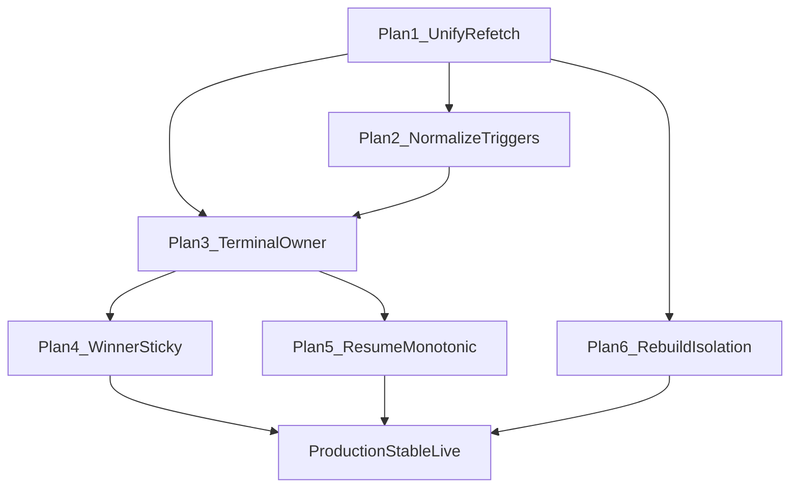

# Live Stabilization — Plan Index

> **For agentic workers:** Execute plans **in order**. Each plan produces working, tested Flutter software with **zero backend changes**. Use `superpowers:subagent-driven-development` (recommended) or `superpowers:executing-plans` per plan.

**Goal:** Make Flutter live transitions production-stable: one sync owner, one terminal path, sticky winner UI, safe resume, quiet cartela rebuilds.

**Architecture:** Keep backend contracts frozen. Collapse Flutter to three paths only — normal socket patch, recovery snapshot, terminal snapshot — as defined in `LIVE_TRANSITION_PRODUCTION_GAPS.md` and `docs/superpowers/specs/2026-07-08-live-transition-stabilization-design.md`.

**Tech Stack:** Flutter, Riverpod, socket_io_client, existing `LiveRealtimeController` / screen mixins / `flutter_test`.

**Hard constraints (all plans):**

- Do **not** change NestJS APIs, Prisma, wallet, registration rules, bingo validation, or socket event names.
- Do **not** invent session status in Flutter (`READY`/`PLAYING`/… come from backend).
- Prefer delete/route over parallel new systems.
- TDD: failing test → minimal fix → pass → commit.
- Commit after each task.

---

## Execution order (do not skip)

| # | Plan file | Ships |
|---|---|---|
| 1 | [2026-07-08-01-unify-canonical-refetch.md](./2026-07-08-01-unify-canonical-refetch.md) | Single refetch owner (`LiveRealtimeController` only) |
| 2 | [2026-07-08-02-socket-normalize-and-trigger-matrix.md](./2026-07-08-02-socket-normalize-and-trigger-matrix.md) | Normalize-all payloads + one action per trigger |
| 3 | [2026-07-08-03-terminal-transition-owner.md](./2026-07-08-03-terminal-transition-owner.md) | FINISHED / NO_WINNER / CANCELLED single owner |
| 4 | [2026-07-08-04-winner-pattern-sticky.md](./2026-07-08-04-winner-pattern-sticky.md) | Immediate winner UI; no pattern flicker |
| 5 | [2026-07-08-05-resume-reconnect-monotonic.md](./2026-07-08-05-resume-reconnect-monotonic.md) | Terminal gates resume; monotonic called numbers |
| 6 | [2026-07-08-06-bingo-lock-rebuild-isolation.md](./2026-07-08-06-bingo-lock-rebuild-isolation.md) | BINGO lock updates without full cartela thrash |

## Dependency graph

## Definition of done (all plans)

- [ ] No screen-local `_scheduleCanonicalRefetch` / `_refetchCanonical` pipeline remains *(Plan 1 optional leftover — dual timers may still exist)*
- [x] Every live socket handler normalizes before map access
- [x] Terminal CANCELLED / FINISHED / NO_WINNER go through one owner
- [x] Winner patterns sticky until session change / complete replacement
- [x] `app_resume` / `socket_reconnect` delayed or ignored during terminal
- [x] Same-session recovery cannot roll called numbers backward
- [x] BINGO lock ticks do not rebuild the full cartela list
- [x] Required regression tests from the gap audit are green *(pre-existing `live_called_number_sync` out-of-order assertion still red; unrelated)*
- [x] Backend untouched (`FriendsBingo` git clean for this work) *(only unrelated `package.json` dirty)*

## Source docs

- `LIVE_TRANSITION_PRODUCTION_GAPS.md`
- `docs/audit/2026-07-08-live-transition-production-gaps.md`
- `docs/superpowers/specs/2026-07-08-live-transition-stabilization-design.md`
- `FriendsBingo/docs/game-operations-lifecycle.md` (read-only reference)
