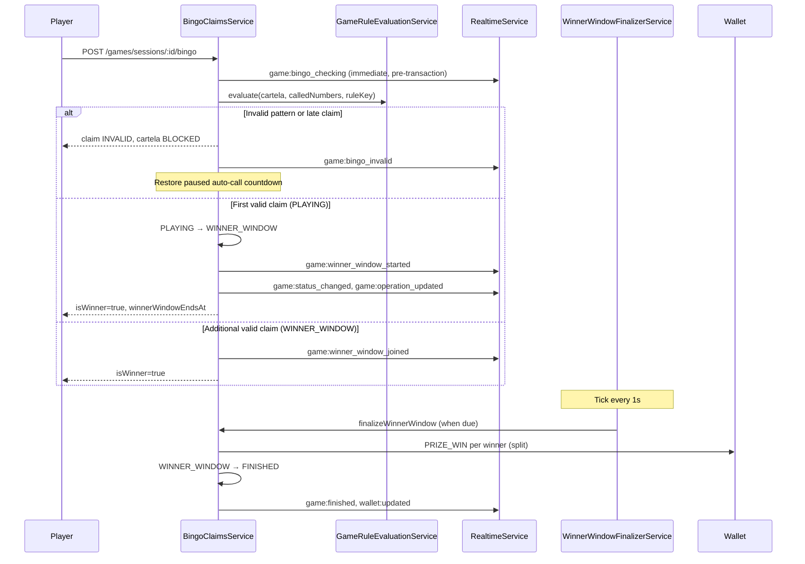

# Winner Window Flow — Code-Verified Documentation

**Date:** July 9, 2026  
**Method:** Read-only analysis of live source code only (no prior markdown/docs used as source).  
**Compared against:** Prior assistant analysis from July 8, 2026 (game-flow documentation).  
**Codebases:** `FriendsBingo` (backend), `friends-admin-dahsboard` (Flutter player app), `friends_bingo_Admin` (Next.js admin)

---

## Table of Contents

1. [Executive Summary](#1-executive-summary)
2. [Corrections to Prior Analysis](#2-corrections-to-prior-analysis)
3. [When the Winner Window Applies](#3-when-the-winner-window-applies)
4. [Timing Configuration (Actual Defaults)](#4-timing-configuration-actual-defaults)
5. [Database Fields](#5-database-fields)
6. [Status Transitions](#6-status-transitions)
7. [End-to-End Flow Diagram](#7-end-to-end-flow-diagram)
8. [Phase 1 — Claim Submission](#8-phase-1--claim-submission)
9. [Phase 2 — Pattern Validation](#9-phase-2--pattern-validation)
10. [Phase 3 — Open Winner Window (First Valid Claim)](#10-phase-3--open-winner-window-first-valid-claim)
11. [Phase 4 — Join Winner Window (Additional Valid Claims)](#11-phase-4--join-winner-window-additional-valid-claims)
12. [Phase 5 — Invalid Claims During Play / Window](#12-phase-5--invalid-claims-during-play--window)
13. [Phase 6 — Finalization & Payout](#13-phase-6--finalization--payout)
14. [Phase 7 — Post-Finish Side Effects](#14-phase-7--post-finish-side-effects)
15. [Manual Rule Path (No Winner Window)](#15-manual-rule-path-no-winner-window)
16. [Cancellation Rules](#16-cancellation-rules)
17. [Real-Time Events & Payloads](#17-real-time-events--payloads)
18. [REST API Surface](#18-rest-api-surface)
19. [Operations Snapshot (`/games/operations/current`)](#19-operations-snapshot-gamesoperationscurrent)
20. [Flutter Player App Behavior](#20-flutter-player-app-behavior)
21. [Admin Dashboard Behavior](#21-admin-dashboard-behavior)
22. [Health Monitoring & Repair](#22-health-monitoring--repair)
23. [Architecture Review](#23-architecture-review)
24. [Production Gaps & Recommendations](#24-production-gaps--recommendations)
25. [File Reference Index](#25-file-reference-index)

---

## 1. Executive Summary

The **winner window** is a timed multi-winner phase for **automatic game rules** (`FULL_HOUSE`, `MIX_*`, etc.). When the first valid BINGO claim arrives during `PLAYING`:

1. Session transitions `PLAYING` → `WINNER_WINDOW`
2. Auto-call stops permanently for that round
3. A countdown starts (`winnerWindowEndsAt`, default **25 seconds** from open)
4. Other players may submit valid claims until the window closes (plus a small server grace)
5. After the window, the backend **splits the prize pool** across all winners and credits wallets
6. Session transitions `WINNER_WINDOW` → `FINISHED`

**Prizes are never paid at claim time.** Payment happens only in `finalizeWinnerWindow()`.

The winner window is **not used** for legacy `MANUAL` rules (those use `CHECKING` + admin approval instead).

---

## 2. Corrections to Prior Analysis

The July 8 analysis was largely accurate. These are **verified corrections and additions** from reading the actual code:

| Prior statement | Code-verified truth |
|-----------------|---------------------|
| Winner window default 25s | ✅ Confirmed: `DEFAULT_WINNER_WINDOW_SECONDS = 25` in `game-timing-config.defaults.ts` |
| Finalize after window + grace | ✅ Confirmed, but grace is a **separate config**: `winnerWindowClaimGraceMs` default **750ms**, not part of the 25s countdown |
| Prizes split at finalize | ✅ Confirmed via `splitPrizeAmount()` — cent-level split with remainder distributed to earliest winners |
| Manual rule uses CHECKING | ✅ Confirmed — `isManualRule()` bypasses winner window entirely |
| MANUAL rule "legacy" | ✅ Confirmed removed from seed (`LEGACY_REMOVED_KEYS` includes `'MANUAL'`) but **runtime code still supports it** if present in DB |
| Admin can finalize early | ✅ API exists: `PATCH /admin/sessions/:id/finalize-winner-window` — **admin UI does not call it** (gap) |
| WINNER_WINDOW cannot be cancelled | ✅ Confirmed — `GameLifecycleService.cancelSession()` throws `BadRequestException` |
| `winnerCartelaId` = sole winner | ❌ **Correction:** set to **first winner by `createdAt ASC`**, but **all** `isWinner` cartelas are paid |
| Push on every join | ❌ **Correction:** push (`notifyWinnerWindowStarted`) fires only on **window open**, not on `game:winner_window_joined` |
| Invalid claim resumes auto-call | ✅ Confirmed with **paused countdown restoration** — remaining `nextAutoCallAt` time is preserved |
| Race: concurrent first claims | ✅ **Added detail:** optimistic `updateMany` on `PLAYING`; if count=0, code **joins existing window** instead of failing |
| Client expiry fallback | ❌ **Not in prior analysis:** Flutter locally transitions to `FINISHED` if countdown expires before `game:finished` socket arrives |
| Two-phase finalize lock | ❌ **Not in prior analysis:** `prizeFinalizedAt` set first as idempotency lock before wallet credits |

---

## 3. When the Winner Window Applies

### Applies (automatic rules)

```typescript
// game-rule-evaluation.service.ts
isManualRule(ruleKey) → (ruleKey ?? 'MANUAL').trim().toUpperCase() === 'MANUAL'
```

If `isManualRule(ruleKey)` is **false**, claims go through `createAutoValidatedClaim()` which can open or join a winner window.

Seeded active rules are `FULL_HOUSE` and `MIX_01`–`MIX_14` (`game-rule.seed-data.ts`). `MANUAL` is in `LEGACY_REMOVED_KEYS`.

### Does NOT apply

| Path | Session transition | Payout |
|------|-------------------|--------|
| `MANUAL` rule claim | `PLAYING` → `CHECKING` | Full `prizeAmount` to single approved winner via `approveClaim()` |
| Invalid auto claim | stays `PLAYING` (or `WINNER_WINDOW` if already open) | None; cartela `BLOCKED` |
| No winner after 75 balls | `PLAYING` → `NO_WINNER` | None; stakes stay in pool |

---

## 4. Timing Configuration (Actual Defaults)

From `src/game-timing-config/game-timing-config.defaults.ts` and `prisma/schema.prisma` (`GameTimingConfig`):

| Config key | Default | Purpose |
|------------|---------|---------|
| `winnerWindowSeconds` | **25** | Countdown shown to players; `winnerWindowEndsAt = now + 25s` on open |
| `winnerWindowClaimGraceMs` | **750** | Extra server-side acceptance after `winnerWindowEndsAt` for in-flight claims |
| `finishedResultDisplaySeconds` | 60 | Grace before next registration opens (bypassed on finalize via `ignoreReviewGrace: true`) |

**Admin can change** both values via `PATCH /admin/time-config` (bounds: window 5–120s, grace 0–2000ms).

### Two different "end" times

```
Player-visible countdown ends at:     winnerWindowEndsAt
Server stops accepting new joins at:  winnerWindowEndsAt + winnerWindowClaimGraceMs
Server finalizes payouts at:          winnerWindowEndsAt + winnerWindowClaimGraceMs
                                      (via finalizeAfter = now - graceMs check)
```

The finalizer scheduler finds sessions where `winnerWindowEndsAt <= now()` but `finalizeWinnerWindow()` internally requires `winnerWindowEndsAt <= now - graceMs` before locking.

---

## 5. Database Fields

`GameSession` (`prisma/schema.prisma`):

| Field | Set when | Purpose |
|-------|----------|---------|
| `winnerWindowStartedAt` | First valid claim opens window | Audit timestamp |
| `winnerWindowEndsAt` | First valid claim opens window | Player countdown deadline |
| `prizeFinalizedAt` | Start of finalization (lock) | Idempotency — prevents double payout |
| `winnerCartelaId` | Finalize | First winner's cartela ID (`createdAt ASC`) |
| `finishedAt` | Finalize | Round end time |
| `autoCallEnabled` | Set `false` on window open | Balls stop permanently |
| `nextAutoCallAt` | Set `null` on window open | Clears scheduled draw |

`GameCartela`:

| Field | Winner | Invalid claim |
|-------|--------|---------------|
| `status` | `WINNER` | `BLOCKED` |
| `isWinner` | `true` | `false` |

`BingoClaim`:

| Field | Notes |
|-------|-------|
| `status` | `VALID` for window winners; `INVALID` for bad claims |
| `winningBallLetter` / `winningBallNumber` | Latest called ball at claim time |
| `reasonCode` | `INVALID_PATTERN`, `INVALID_LATE_CLAIM`, `ALREADY_BLOCKED`, `ALREADY_WINNER` |

Index: `@@index([status, winnerWindowEndsAt, prizeFinalizedAt])` — supports finalizer queries.

---

## 6. Status Transitions

From `src/games/game-status.rules.ts`:

```
PLAYING → WINNER_WINDOW   (first valid auto claim)
WINNER_WINDOW → FINISHED  (finalizeWinnerWindow)
WINNER_WINDOW → CANCELLED (theoretically allowed by rules, but cancelSession blocks it)
```

`WINNER_WINDOW` is treated as an **active/live** session globally (same invariant bucket as `PLAYING` and `CHECKING`):

```typescript
// game-operation-invariants.service.ts — at most one PLAYING/CHECKING/WINNER_WINDOW session
```

---

## 7. End-to-End Flow Diagram



---

## 8. Phase 1 — Claim Submission

**Entry:** `POST /games/sessions/:id/bingo`  
**Controller:** `games.controller.ts` → `GamesService.claimBingo()` → `BingoClaimsService.claimBingo()`

**Auth:** JWT required, `PLAYER` role, throttling skipped (`@SkipAppThrottlers`).

**Body:** `{ gameCartelaId: string }`

### Pre-transaction UX emit

Before the DB transaction, if the cartela is `REGISTERED` and not already a winner:

```typescript
// bingo-claims.service.ts:163-169
this.realtimeService.emitToGame(sessionId, 'game:bingo_checking', {
  sessionId, userId, gameCartelaId, cartelaNumber, nextAutoCallAt: null,
});
```

This gives immediate "checking" feedback while validation runs.

### Terminal cartela short-circuit

If cartela is `BLOCKED` or already `WINNER`, returns idempotent `already_resolved` response **without** re-emitting side effects. May create an `INVALID` claim record with `ALREADY_BLOCKED` or `ALREADY_WINNER` reason code.

---

## 9. Phase 2 — Pattern Validation

**Service:** `createAutoValidatedClaim()` in `bingo-claims.service.ts`

### Preconditions

- Cartela must be `REGISTERED`
- Session must be `PLAYING` or `WINNER_WINDOW`
- Game must not be `FINISHED` or `NO_WINNER`

### Auto-call pause (PLAYING only)

If session is `PLAYING` and `autoCallEnabled`:

1. Capture remaining time until `nextAutoCallAt`
2. Set `nextAutoCallAt = null` in DB (prevents draw mid-check)
3. On **invalid** claim: restore countdown via `computeInvalidClaimResumeAt()`
4. On **valid** claim: auto-call stays disabled (window path)

### Evaluation

```typescript
evaluation = gameRuleEvaluationService.evaluate(cartela, calledNumbers, ruleKey, patterns)
```

Two rejection paths:

| Condition | `reasonCode` | Cartela result |
|-----------|--------------|----------------|
| `!evaluation.isWinner` | `INVALID_PATTERN` | `BLOCKED` |
| `!evaluation.completedByLatestNumber` | `INVALID_LATE_CLAIM` | `BLOCKED` |

**Late claim rule:** The winning pattern must complete on the **latest called number** (`completedByLatestNumber`). A pattern that was already complete before the last ball was drawn is rejected as late.

**Winning ball:** `resolveWinningBallFromCalledNumbersSnapshot(calledNumbers)` — always the latest called number, stored on the claim record.

---

## 10. Phase 3 — Open Winner Window (First Valid Claim)

**Method:** `createAutoValidOpenOrJoinWindowClaim()` when session status is `PLAYING`

### Optimistic open

```typescript
// updateMany WHERE status = PLAYING
data: {
  status: WINNER_WINDOW,
  winnerWindowStartedAt: now,
  winnerWindowEndsAt: now + winnerWindowDurationMs,  // default +25s
  autoCallEnabled: false,
  nextAutoCallAt: null,
  noWinnerGraceEndsAt: null,
  noWinnerReason: null,
}
```

### Race handling

If `updateMany` returns `count === 0` (another claim opened the window concurrently):

1. Re-read session — must be `WINNER_WINDOW` with `winnerWindowEndsAt` set
2. Log warning and **delegate to join path** (`createAutoValidJoinWindowClaim`)
3. Does not throw to the player

### Winner cartela + claim

- Cartela: `REGISTERED` → `WINNER`, `isWinner = true`
- Claim: `status = VALID`, stores `winningBallLetter/Number`
- Audit: `player.bingo.winner_window.opened`

### Realtime emits (post-transaction)

| Event | Rooms |
|-------|-------|
| `game:winner_window_started` | session, admin, claiming user |
| `game:status_changed` | session, admin, public |
| `game:operation_updated` | via `emitGameOperationUpdate` |
| Push notification | All session participants (`notifyWinnerWindowStarted`) |

### HTTP response shape

```json
{
  "claim": { "status": "VALID", ... },
  "isWinner": true,
  "gameStatus": "WINNER_WINDOW",
  "gameCartelaStatus": "WINNER",
  "winnerWindowEndsAt": "2026-07-09T12:00:25.000Z",
  "completedPatterns": [...],
  "lastCalledNumber": { "letter": "N", "number": 42 },
  "progress": 0.85,
  "nextAutoCallAt": null
}
```

---

## 11. Phase 4 — Join Winner Window (Additional Valid Claims)

**Method:** `createAutoValidJoinWindowClaim()` when session is already `WINNER_WINDOW`

### Acceptance window

```typescript
if (!winnerWindowEndsAt ||
    checkedAt > winnerWindowEndsAt + winnerWindowClaimGraceMs) {
  throw BadRequestException('Winner window has already closed');
}
```

Players can claim during the visible countdown **and** up to 750ms after it (server grace for network latency).

### Same validation as open

- Must pass pattern evaluation
- Must pass `completedByLatestNumber` (late claim check)
- Cartela must be `REGISTERED`, not already winner

### Emits

| Event | Push? |
|-------|-------|
| `game:winner_window_joined` | No |
| `game:status_changed` | No (status unchanged) |
| `game:operation_updated` | Yes (structural update) |

Audit action: `player.bingo.winner_window.joined`

### Prize implication

Joining does **not** change `winnerWindowEndsAt`. The deadline is fixed at first open. All winners at finalize time split `session.prizeAmount` equally (with cent remainder).

---

## 12. Phase 5 — Invalid Claims During Play / Window

### During PLAYING

- Cartela permanently `BLOCKED` for the session
- Auto-call countdown **restored** to pre-claim remaining time
- Emits: `game:bingo_invalid`, `game:status_changed` (status stays PLAYING)

### During WINNER_WINDOW

- Same blocking behavior
- Session stays `WINNER_WINDOW`
- Auto-call already disabled — no resume needed
- Other players can still claim if window is open

### Idempotent re-claims

`ALREADY_BLOCKED` / `ALREADY_WINNER` return existing claim data without mutating state or re-emitting events (`kind: 'already_resolved'`).

---

## 13. Phase 6 — Finalization & Payout

### Automatic finalization

**Scheduler:** `WinnerWindowFinalizerService` — ticks every **1000ms**

```typescript
// Finds: status=WINNER_WINDOW, winnerWindowEndsAt <= now, prizeFinalizedAt=null
await bingoClaimsService.finalizeWinnerWindow(session.id);
```

### Finalization algorithm (`finalizeWinnerWindow`)

**Step 1 — Idempotency lock:**

```typescript
updateMany WHERE {
  status: WINNER_WINDOW,
  prizeFinalizedAt: null,
  winnerWindowEndsAt: { lte: now - claimGraceMs }
}
data: { prizeFinalizedAt: now }
```

If `count !== 1`, returns `null` (already finalized or not yet due).

**Step 2 — Load winners:**

```typescript
gameCartelas WHERE isWinner=true AND status=WINNER
ORDER BY createdAt ASC
```

Must have at least one winner or throws `ConflictException`.

**Step 3 — Split and credit:**

```typescript
prizeShares = splitPrizeAmount(session.prizeAmount, winnerCount)
// Per winner: WalletTransactionType.PRIZE_WIN, referenceType=GAME_CARTELA
```

`splitPrizeAmount` divides in cents, distributes remainder cents to earliest winners.

**Step 4 — Finish session:**

```typescript
updateMany WHERE status=WINNER_WINDOW, prizeFinalizedAt not null, winnerCartelaId=null
data: {
  status: FINISHED,
  winnerCartelaId: firstWinner.id,  // primary display winner only
  finishedAt: now,
}
```

**Step 5 — Queue restore + next registration:**

- `gameQueueService.restoreSlotAfterSession()`
- `postGameRegistrationOpenerService.openNextAutoQueueRegistrationInTransaction({ ignoreReviewGrace: true })`

**Step 6 — Post-transaction emits:**

- `wallet:updated` per winner
- `emitSessionFinished()` → `game:status_changed`, `game:finished`, `game:operation_updated`

### Admin early finalize

**API:** `PATCH /admin/sessions/:id/finalize-winner-window`  
**Service:** `finalizeWinnerWindowEarly(sessionId, actorId)`

1. Sets `winnerWindowEndsAt = now` (forces scheduler eligibility)
2. Calls `finalizeWinnerWindow()` immediately
3. Audit: `admin.winner_window.finalize_early`

This is the **only supported way** to end a winner window before the countdown — cancellation is explicitly blocked.

---

## 14. Phase 7 — Post-Finish Side Effects

`GameEngineService.emitSessionFinished()`:

1. Builds `winnerPayoutsSummary` and full `winnerResults` via `buildSessionWinnerResults()`
2. Emits terminal payloads with winner boards, patterns, prize amounts
3. Sends session-finished push notifications
4. Invalidates `operations/current` cache (500ms TTL)

`GET /games/sessions/:id/winner-results` becomes available for clients that need enriched winner display data.

---

## 15. Manual Rule Path (No Winner Window)

If `isManualRule(ruleKey)`:

```
PLAYING → CHECKING (on claim)
Admin approve → FINISHED (single winner, full prizeAmount)
Admin reject  → PLAYING (cartela BLOCKED)
```

- `approveClaim()` credits **entire** `prizeAmount` to one winner (no split)
- Uses `finishGameWithWinner()` not `finalizeWinnerWindow()`
- Emits `game:bingo_valid` (not `game:winner_window_started`)

**Production note:** `MANUAL` is removed from seed data. Live games use automatic rules and the winner window path.

---

## 16. Cancellation Rules

```typescript
// game-lifecycle.service.ts:168-171
if (existing.status === GameStatus.WINNER_WINDOW) {
  throw new BadRequestException(
    'Winner window sessions cannot be cancelled. Finalize the winner window early...'
  );
}
```

`games.service.ts` comment confirms: admin cancel allows `READY`, `PLAYING`, `CHECKING` only — **not** `WINNER_WINDOW`.

---

## 17. Real-Time Events & Payloads

### Events in winner window lifecycle

| Event | When | Key payload fields |
|-------|------|-------------------|
| `game:bingo_checking` | Claim starts (pre-tx) | `sessionId`, `gameCartelaId`, `cartelaNumber` |
| `game:winner_window_started` | First valid claim | `winnerWindowEndsAt`, `completedPatterns`, `lastCalledNumber`, `matchedPattern` |
| `game:winner_window_joined` | Additional valid claim | Same shape as started |
| `game:bingo_invalid` | Invalid claim | `reason`, `reasonCode` |
| `game:status_changed` | Open/join/invalid | Full session snapshot |
| `game:operation_updated` | Structural change | Slot + session ops snapshot |
| `game:finished` | After finalize | Terminal context with `winnerResults` |
| `wallet:updated` | After payout | Serialized wallet per winner |

### `game:winner_window_started` payload (actual)

```typescript
{
  sessionId: string,
  userId: string,
  gameCartelaId: string,
  cartelaNumber: number,
  claimId: string,
  matchedPattern: string,
  winnerWindowEndsAt: string | null,  // ISO timestamp
  completedPatterns: SerializedCompletedPattern[],
  lastCalledNumber: { letter: string, number: number } | null,
}
```

---

## 18. REST API Surface

| Method | Path | Role | Purpose |
|--------|------|------|---------|
| `POST` | `/games/sessions/:id/bingo` | PLAYER | Submit claim (open/join window) |
| `GET` | `/games/sessions/:id/winner-results` | PLAYER | Winner boards, patterns, prize shares |
| `GET` | `/games/operations/current` | Optional auth | Canonical live snapshot |
| `PATCH` | `/admin/sessions/:id/finalize-winner-window` | ADMIN | Force early finalize + payout |
| `GET` | `/admin/time-config` | ADMIN | Read timing |
| `PATCH` | `/admin/time-config` | ADMIN | Update `winnerWindowSeconds`, `winnerWindowClaimGraceMs` |

---

## 19. Operations Snapshot (`/games/operations/current`)

`WINNER_WINDOW` sessions appear in `liveGame` (same bucket as `PLAYING`):

```typescript
// games.service.ts:3249-3250
findFirstOperationsSession([GameStatus.PLAYING, GameStatus.WINNER_WINDOW], isAdmin)
```

Player-facing status string: `'winnerWindow'` (mapped in `buildFastSessionSnapshot`).

Priority when multiple sessions exist: `PLAYING` (0) beats `WINNER_WINDOW` (1) in `compareOperationPriority`.

Response includes `winnerWindowEndsAt` on the live game item.

---

## 20. Flutter Player App Behavior

**Package:** `friends_bingo_app` in `friends-admin-dahsboard/`

**Presentation contract:** Backend owns session status. Flutter derives `LiveUiMode` only. See also [`docs/audit/2026-07-10-winner-flow-backend-mobile-gap-stability.md`](./audit/2026-07-10-winner-flow-backend-mobile-gap-stability.md).

### Claim submission

`live_game_called_numbers.dart` → `_claimBingo()`:

1. Optimistically pauses `nextAutoCallAt` locally during claim
2. `POST /games/sessions/:id/bingo`
3. On valid winner window result: applies `winnerWindowEndsAt` + local ops overlay **immediately** (skips the ~800ms checking min-display)
4. Stores sticky winning patterns on the cartela
5. Invalid/blocked outcomes still honor the checking min-display delay

### Socket handlers

Both `game:winner_window_started` and `game:winner_window_joined` route to `_onWinnerWindowEvent()`:

1. Normalize payload
2. Apply `winnerWindowEndsAt` to countdown tracker
3. Set local status to `winnerWindow` + refresh local ops overlay
4. Store `completedPatterns` for sticky cartela display
5. Dismiss any open winner modal (modal is finished-only)
6. Schedule canonical refetch (`winner_window_enrich`)
7. **Do not** auto-open the Winning cartelas dialog

### Countdown display

`live_game_winner_window.dart` → `_buildWinnerWindowBanner()`:

- Uses `_effectiveWinnerWindowEndsAt` = `_game.winnerWindowEndsAt ?? _countdown.winnerWindowEndsAt`
- **Never estimated locally**
- `isWinnerWindowActive()`: `now.isBefore(windowEndsAt)` — strict less-than
- When expired while still `WINNER_WINDOW`: shows **“Finalizing winners…”** closing hold (not review)

### Claim eligibility during window

`bingo_claim_eligibility.dart`:

```dart
game.status == playing || game.status == winnerWindow
&& !winnerWindowExpired && !hasPendingClaim && !isCountdownLocked
&& cartela not blocked/cancelled/winner
```

### Client-side expiry (no invent FINISHED)

If server `game:finished` is delayed, `_enterFinishedReviewFromExpiredWindow()`:

1. Detects `winnerWindowExpired` locally
2. Sets UI-only `winnerWindowClosing` (keeps `_game.status == winnerWindow`)
3. Requests terminal canonical refetch + capped 1s poll (max 15)
4. **Does not** set local `FINISHED` or start post-game summary
5. Review starts only after canonical `FINISHED` / `NO_WINNER` apply (`_runTerminalSideEffectsAfterCanonicalApply`)

Wallet credit still requires server finalize.

### Winner results enrichment

- Preload polling during last seconds of window: `syncWinnerWindowPreloadPolling()` (cache only — no modal)
- Post-finish: `GET /games/sessions/:id/winner-results`
- Display merges socket claim snapshots + API results
- Auto winner modal opens only during post-game summary with **API-complete** rows (no sticky `#0` / `0 ETB` placeholders)

---

## 21. Admin Dashboard Behavior

**App:** `friends_bingo_Admin` (Next.js)

### What works

- `liveGame` shows `playerStatus === "winnerWindow"`
- Countdown badge from `winnerWindowEndsAt` (1s local ticker)
- Winner payout summary badges when `winnerPayoutsSummary` present in ops snapshot
- Socket listeners for `game:winner_window_started/joined` → structural refresh (but **socket not connected** — falls back to 5s HTTP polling)

### What is missing (code gap)

| Backend capability | Admin UI |
|-------------------|----------|
| `PATCH /admin/sessions/:id/finalize-winner-window` | **No button/API call in admin.ts or game-operations.tsx** |
| Cancel during winner window | Correctly blocked by backend; no UI needed |

Admins must wait for automatic finalization or call the API manually (e.g. Postman).

---

## 22. Health Monitoring & Repair

### Health endpoint

`/health` reports `degraded` when:

```typescript
status = WINNER_WINDOW
AND winnerWindowEndsAt <= now
AND prizeFinalizedAt = null
```

Counts as `stuckSessions.overdueWinnerWindows`.

### Finalizer reliability

- Single-process `setInterval` — dies with the Node process
- No distributed leader election
- Per-session try/catch in tick loop — one failure doesn't block others

---

## 23. Architecture Review

### Strengths

| Area | Assessment |
|------|------------|
| **Idempotent payout** | `prizeFinalizedAt` lock + `updateMany` guards prevent double credit |
| **Race on open** | Optimistic open with join fallback handles concurrent first claims |
| **Late claim prevention** | `completedByLatestNumber` enforced server-side |
| **Auto-call safety** | Pause during evaluation prevents ball draw mid-check |
| **Cent-accurate split** | `splitPrizeAmount` handles indivisible prize pools |
| **Separation of concerns** | Claims in `BingoClaimsService`, finish emit in `GameEngineService` |
| **Client contract** | Rich socket payloads (`completedPatterns`, `lastCalledNumber`) reduce polling |

### Weaknesses / risks

| Area | Risk | Severity |
|------|------|----------|
| **In-process finalizer** | Process crash between window end and finalize delays payouts | Medium |
| **No admin UI for early finalize** | Ops cannot force-close window from dashboard | Medium |
| **Expiry → FINISHED gap UX** | Player sees “Finalizing…” until server finish (Flutter no longer invents FINISHED) | Low (UX timing) |
| **750ms grace invisible to players** | Countdown ends but server still accepts joins briefly | Low |
| **Single global active session** | Winner window blocks all other live games (by design) | Info |
| **Admin socket broken** | Admin sees winner window via polling only | Medium |

### Design pattern assessment

The winner window follows a **claim-now-pay-later** pattern appropriate for multi-winner bingo:

```
Validate → Reserve winners → Time-boxed join → Atomic payout batch
```

This is sound. The main production gap is **operational tooling** (admin finalize button, distributed finalizer) not game logic correctness.

---

## 24. Production Gaps & Recommendations

### P0 — Admin finalize button

**Problem:** `PATCH /admin/sessions/:id/finalize-winner-window` exists in backend but is not wired in `friends_bingo_Admin`.

**Fix:** Add "Finalize winners now" action in `game-operations.tsx` when `playerStatus === "winnerWindow"`. Add `finalizeWinnerWindowEarly()` to `lib/api/admin.ts`.

### P1 — Distributed finalizer

**Problem:** `WinnerWindowFinalizerService` is in-process only.

**Fix:** Move to BullMQ repeatable job (dependency already in `package.json`) with leader election, or external cron calling an idempotent finalize endpoint.

### P1 — Alerting on overdue windows

**Problem:** Health reports `overdueWinnerWindows` but no automated alert.

**Fix:** Monitor `/health` → `stuckSessions.overdueWinnerWindows > 0` for > 30s.

### P2 — Client/server countdown alignment

**Problem:** Flutter may locally transition to `FINISHED` before `wallet:updated` arrives.

**Fix:** Gate post-game summary wallet display on `wallet:updated` or refetch `GET /wallet/me` after `game:finished`.

### P2 — Document grace period

**Problem:** 750ms server grace is not shown in player countdown.

**Fix:** Either absorb grace into displayed countdown or document as intentional server-only buffer (current behavior is acceptable for latency tolerance).

---

## 25. File Reference Index

### Backend (`FriendsBingo`)

| File | Role |
|------|------|
| `src/bingo-claims/bingo-claims.service.ts` | Core claim, open, join, finalize logic |
| `src/bingo-claims/winner-window-finalizer.service.ts` | 1s scheduler tick |
| `src/bingo-claims/winning-ball.util.ts` | Latest-ball resolution |
| `src/bingo-claims/prize-split.util.ts` | Cent-level prize split |
| `src/bingo-claims/bingo-claims.winner-window.spec.ts` | Winner window unit tests |
| `src/game-engine/game-engine.service.ts` | `emitSessionFinished`, `finishGameWithWinner` |
| `src/game-timing-config/game-timing-config.defaults.ts` | Default 25s / 750ms |
| `src/games/game-status.rules.ts` | Allowed transitions |
| `src/games/game-lifecycle.service.ts` | Cancel blocks WINNER_WINDOW |
| `src/games/games.service.ts` | `operations/current`, claim delegate |
| `src/games/games.controller.ts` | Player claim + winner-results endpoints |
| `src/games/session-winner-results.builder.ts` | Post-finish winner display data |
| `src/admin/admin.controller.ts` | Early finalize endpoint |
| `src/health/health.service.ts` | Overdue window detection |
| `prisma/schema.prisma` | Session/cartela/claim models |

### Flutter (`friends-admin-dahsboard`)

| File | Role |
|------|------|
| `lib/.../live_game_called_numbers.dart` | `_claimBingo()` HTTP submission |
| `lib/.../live_game_orchestration.dart` | Socket handlers, expiry fallback |
| `lib/.../live_game_winner_window.dart` | Winner window banner UI |
| `lib/.../live_presentation_phase.dart` | `isWinnerWindowActive/Expired` |
| `lib/.../bingo_claim_eligibility.dart` | Claim button eligibility |
| `lib/.../live_review_controller.dart` | Winner results preload/poll |
| `lib/.../bingo_claim_result.dart` | HTTP response model |
| `lib/.../games_repository.dart` | API calls |

### Admin (`friends_bingo_Admin`)

| File | Role |
|------|------|
| `components/admin/game-operations.tsx` | Winner window display (no finalize action) |
| `components/admin/time-config-management.tsx` | Timing config UI |
| `lib/api/types.ts` | `winnerWindowEndsAt` types |

---

**Document source:** Live code inspection only.  
**Last updated:** July 9, 2026
